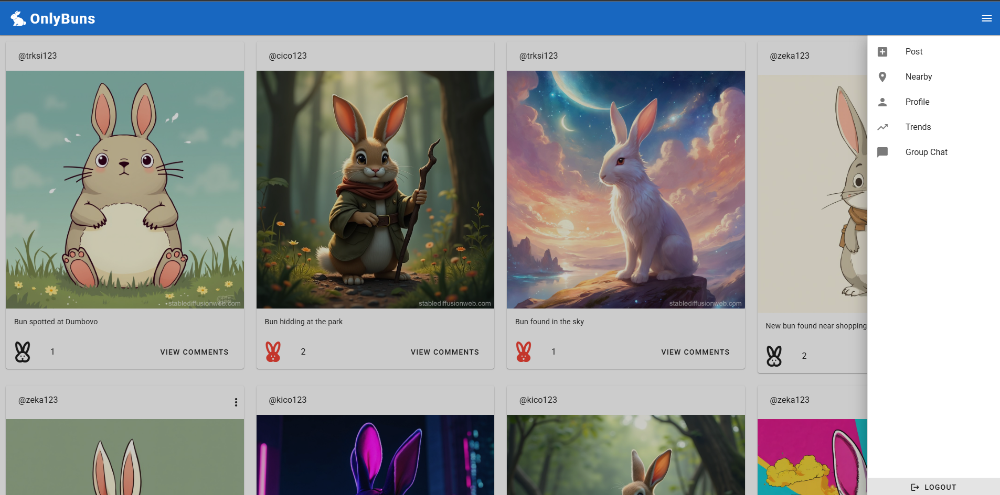
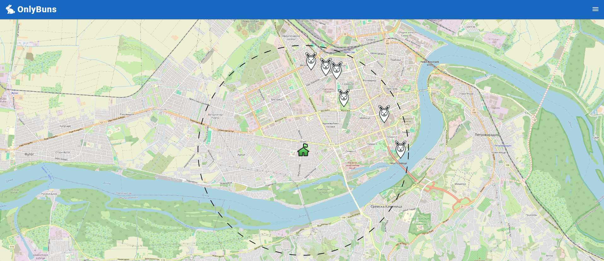

# OnlyBuns

OnlyBuns is a full-stack application and social media platform for bunny lovers. It allows users to create accounts, post images of their bunnies, and interact with other users' posts.





## Project Overview

- Frontend: Vue 3 with Vueitify UI framework
- Backend: Express.js API server
- Databases: PostgreSQL, MongoDB, and Redis
- Message Broker: RabbitMQ and custom REST API broker implementation
- Monitoring: Prometheus and Grafana
- Vets Service: Standalone service that sends location data to RabbitMQ or custom REST API broker

## Getting Started

### Prerequisites
- Docker v28.0 or higher
- Docker Compose v1.29.0 or higher

### Build and start services
From the root directory of the project, run the following command to build and start all services defined in the `docker-compose.yml` file:

```bash
docker compose up -d
```

### Access services
Once the services are up and running, you can access them as follows:

- Frontend: Open your web browser and navigate to `localhost:8080`
- Backend: Running on `localhost:3000`
- Monitoring: Open your web browser and navigate to `localhost:9090` for Prometheus and `localhost:4000` for Grafana

### Stop services
To stop all services, run:
```bash
docker compose down
```

To remove all volumes (including database data):
```bash
docker compose down -v
```

### Configuration

You can configure various aspects of the application by modifying the `.env` files for each component of the system. The main `.env` file is located in the `backend` directory, and it contains settings for the backend server, databases, and message broker.

### Developers
- Nikola Kuslakovic RA 8/2021
- Nemanja Zekanovic RA 73/2021
- Stefan Trkulja RA 150/2021